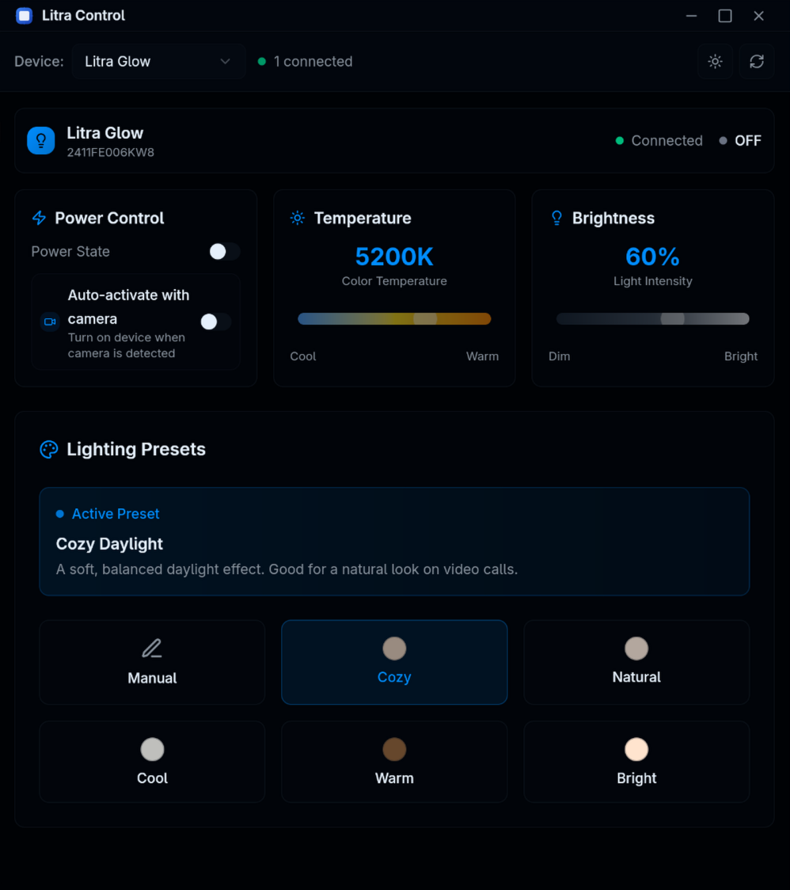

<div align="center">
  
  
  # Litra Control
  
  ### Professional lighting control for Logitech Litra devices
  
  [](https://github.com/your-username/litra-control/actions)
  [](LICENSE)
  [](https://github.com/your-username/litra-control/releases)
  [](https://github.com/your-username/litra-control)
  
  <p align="center">
    <a href="#features">Features</a> •
    <a href="#installation">Installation</a> •
    <a href="#usage">Usage</a> •
    <a href="#development">Development</a> •
    <a href="#contributing">Contributing</a>
  </p>
  
  
</div>

---

## ✨ Features

<div align="center">
  <table>
    <tr>
      <td align="center" width="33%">
        <strong>🎛️ Device Control</strong>
        <br>Precise brightness and color temperature adjustment
      </td>
      <td align="center" width="33%">
        <strong>🎨 Smart Presets</strong>
        <br>5 professional lighting scenarios with intelligent detection
      </td>
      <td align="center" width="33%">
        <strong>📹 Auto Camera</strong>
        <br>Automatically activates when camera is detected
      </td>
    </tr>
    <tr>
      <td align="center" width="33%">
        <strong>🖥️ Modern UI</strong>
        <br>Clean, responsive interface with dark/light themes
      </td>
      <td align="center" width="33%">
        <strong>🔗 Multi-Device</strong>
        <br>Control multiple Litra devices simultaneously
      </td>
      <td align="center" width="33%">
        <strong>🐧 Native Linux</strong>
        <br>Built with Tauri for optimal performance
      </td>
    </tr>
  </table>
</div>

### 🎯 Supported Devices

- **Logitech Litra Glow** - Perfect for video calls and streaming
- **Logitech Litra Beam** - Professional-grade adjustable lighting
- **Logitech Litra Beam LX** - Premium streaming key light

### 🎨 Lighting Presets

| Preset | Temperature | Brightness | Best For |
|--------|-------------|------------|----------|
| **Cozy Daylight** | 5200K | 60% | Natural video calls |
| **Natural Balance** | 5600K | 70% | Accurate color representation |
| **Cool Blue** | 6500K | 75% | Crisp, energetic streaming |
| **Warm Candlelight** | 3000K | 40% | Ambient, comfortable lighting |
| **Bright Companionship** | 5000K | 100% | Maximum illumination |

---

## 🚀 Installation

### Quick Install (Recommended)

<details>
<summary><strong>Ubuntu/Debian (.deb)</strong></summary>

```bash
# Download and install
wget https://github.com/itsyaasir/litra-control/releases/latest/download/litra-control_amd64.deb
sudo dpkg -i litra-control_amd64.deb
sudo apt-get install -f  # Fix any missing dependencies
```

</details>

<details>
<summary><strong>Fedora/RHEL/openSUSE (.rpm)</strong></summary>

```bash
# Download and install
wget https://github.com/itsyaasir/litra-control/releases/latest/download/litra-control.x86_64.rpm
sudo rpm -i litra-control.x86_64.rpm
```

</details>

<details>
<summary><strong>Universal Linux (AppImage)</strong></summary>

```bash
# Download and run
wget https://github.com/itsyaasir/litra-control/releases/latest/download/litra-control.AppImage
chmod +x litra-control.AppImage
./litra-control.AppImage
```

</details>

### 📦 Package Managers

<details>
<summary><strong>Arch Linux (AUR)</strong></summary>

```bash
# Using yay
yay -S litra-control

# Using paru
paru -S litra-control
```

</details>

<details>
<summary><strong>Flatpak</strong></summary>

```bash
# Install from Flathub
flatpak install flathub com.litra.control

# Run
flatpak run com.litra.control
```

</details>

---

## 💡 Usage

### First Time Setup

1. **Connect your Litra device** via USB
2. **Launch Litra Control** from your applications menu
3. **Grant permissions** when prompted (automatic with package install)
4. **Select your device** from the dropdown menu

### Controls

- **🔆 Brightness**: Adjust from 0-100% with smooth sliders
- **🌡️ Temperature**: Fine-tune color temperature (2700K-6500K)
- **⚡ Power**: Toggle device on/off with custom titlebar controls
- **🎨 Presets**: One-click professional lighting scenarios
- **📹 Auto Camera**: Automatically activates when camera is detected

### Keyboard Shortcuts

| Shortcut | Action |
|----------|--------|
| `Space` | Toggle power |
| `↑/↓` | Adjust brightness |
| `←/→` | Adjust temperature |
| `1-5` | Apply preset 1-5 |
| `Ctrl+Q` | Quit application |

---

## 🛠️ Development

### Prerequisites

- **Rust** 1.70+ ([Install Rust](https://rustup.rs/))
- **Node.js** 18+ ([Install Node.js](https://nodejs.org/))
- **pnpm** ([Install pnpm](https://pnpm.io/installation))

### System Dependencies

<details>
<summary><strong>Ubuntu/Debian</strong></summary>

```bash
sudo apt update
sudo apt install libwebkit2gtk-4.0-dev build-essential curl wget \
  libssl-dev libgtk-3-dev libayatana-appindicator3-dev librsvg2-dev libudev-dev
```

</details>

<details>
<summary><strong>Fedora</strong></summary>

```bash
sudo dnf install webkit2gtk3-devel openssl-devel gtk3-devel \
  libappindicator-gtk3-devel librsvg2-devel systemd-devel
```

</details>

<details>
<summary><strong>Arch Linux</strong></summary>

```bash
sudo pacman -S webkit2gtk openssl gtk3 libappindicator-gtk3 librsvg systemd
```

</details>

### Build Instructions

```bash
# Clone the repository
git clone https://github.com/itsyaasir/litra-control.git
cd litra-control

# Install dependencies
pnpm install

# Development mode (hot reload)
pnpm tauri dev

# Build for production
pnpm tauri build

# Build Linux packages
./build-linux.sh
```

### Project Structure

```
litra-control/
├── src/                    # Vue.js frontend
│   ├── components/         # UI components
│   ├── composables/        # Vue composables
│   ├── stores/             # Pinia stores
│   └── assets/             # Static assets
├── src-tauri/              # Rust backend
│   ├── src/                # Rust source code
│   ├── icons/              # Application icons
│   └── packaging/          # Linux packaging files
└── docs/                   # Documentation
```

### Technology Stack

- **Frontend**: Vue 3 + TypeScript + Vite
- **Backend**: Rust + Tauri
- **UI Framework**: Tailwind CSS + Shadcn/ui
- **State Management**: Pinia
- **Build System**: Vite + Cargo

---

## 🤝 Contributing

We welcome contributions! Please see our [Contributing Guide](CONTRIBUTING.md) for details.

### Quick Start

1. **Fork** the repository
2. **Create** a feature branch (`git checkout -b feature/amazing-feature`)
3. **Commit** your changes (`git commit -m 'Add amazing feature'`)
4. **Push** to the branch (`git push origin feature/amazing-feature`)
5. **Open** a Pull Request

### Development Guidelines

- Follow [Rust style guidelines](https://doc.rust-lang.org/1.0.0/style/README.html)
- Use [Vue 3 Composition API](https://vuejs.org/guide/extras/composition-api-faq.html)
- Write tests for new features
- Update documentation as needed

---

## 📋 Troubleshooting

<details>
<summary><strong>Device not detected</strong></summary>

1. Ensure device is connected via USB
2. Check udev rules: `ls -la /etc/udev/rules.d/99-litra-control.rules`
3. Verify group membership: `groups $USER`
4. Reload udev rules: `sudo udevadm control --reload-rules && sudo udevadm trigger`
5. Log out and log back in

</details>

<details>
<summary><strong>Permission denied</strong></summary>

1. Add user to plugdev group: `sudo usermod -a -G plugdev $USER`
2. Log out and log back in
3. Check device permissions: `ls -la /dev/hidraw*`

</details>

<details>
<summary><strong>Build issues</strong></summary>

1. Update Rust: `rustup update`
2. Clear cache: `cargo clean && pnpm store prune`
3. Reinstall dependencies: `pnpm install`
4. Check system dependencies above

</details>

---

## 📄 License

This project is licensed under the MIT License - see the [LICENSE](LICENSE) file for details.

---

## 🙏 Acknowledgments

- **Logitech** for creating the Litra device series
- **[timrogers/litra-rs](https://github.com/timrogers/litra-rs)** for the Rust Litra library
- **[timrogers/litra-autotoggle](https://github.com/timrogers/litra-autotoggle)** for auto-toggle inspiration
- **Tauri team** for the amazing framework
- **Vue.js community** for the excellent ecosystem

---

<div align="center">
  <p><strong>Made with ❤️ for the Linux community</strong></p>
  <p>
    <a href="https://github.com/itsyaasir/litra-control/releases">Download</a> •
    <a href="https://github.com/itsyaasir/litra-control/issues">Report Bug</a> •
    <a href="https://github.com/itsyaasir/litra-control/discussions">Request Feature</a>
  </p>
</div>